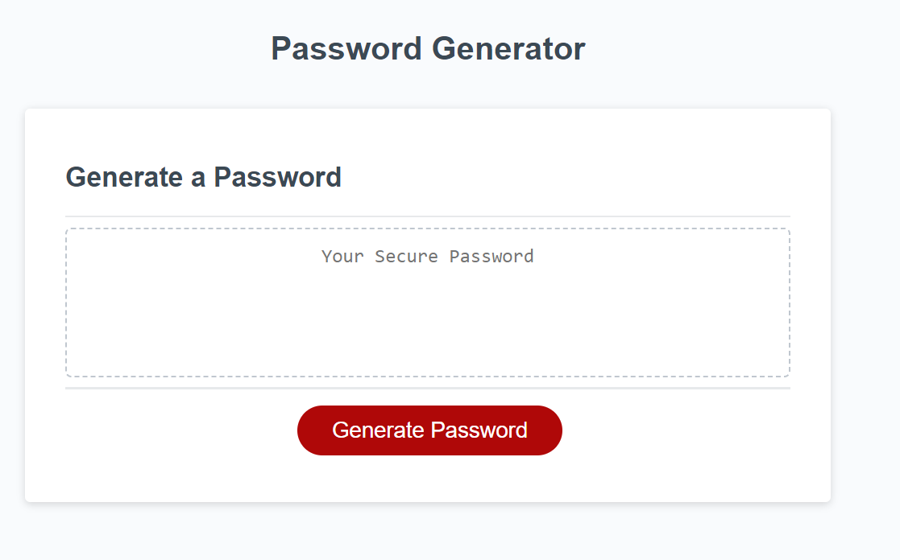

# Password Generator Starter Code

## Description

This webpage is a password generator. The challenge provided a starter code that I copied from a repository, and I created the password generator function that first gets the user's inputs through a series of windows alerts asking what criteria the user wants for their password, and based on the user's answers, the function adds the chosen elements into a variable. Then I randomly get elements from the variable and that is display to the user. I also added validations in case the user does not follow the webpade's guide and either enters numbers outside the scope, or enters a letter or a symbol instead of a number.

My motivation was to start getting comfortable programming in javascript. I also wanted to be able to develop my own code and start thinking as a programmer.

## Usage

The page will have a non-editable text box and a button. After clicking the Generate Password button, there will be a prompt that will ask to enter a length between 8 and 128 characters. If the user enters a letter or a symbol, there will a validation asking to enter a number. If the number entered is outside the said parameters, there will be another validation asking the user to enter a valid number. After that, the webpage will ask if the user wants to add uppercase and lowercase letters, as well as numbers and symbols. The user can choose what to add and then the webpage will show the password in the textbox.

Link to the deployed app https://ginitadavis.github.io/Password-Generator/

## License
Copyright (c) [2022] [Gina Davis]

Permission is hereby granted, free of charge, to any person obtaining a copy of this software and associated documentation files (the "Software"), to deal in the Software without restriction, including without limitation the rights to use, copy, modify, merge, publish, distribute, sublicense, and/or sell copies of the Software, and to permit persons to whom the Software is furnished to do so, subject to the following conditions:

The above copyright notice and this permission notice shall be included in all copies or substantial portions of the Software.

THE SOFTWARE IS PROVIDED "AS IS", WITHOUT WARRANTY OF ANY KIND, EXPRESS OR IMPLIED, INCLUDING BUT NOT LIMITED TO THE WARRANTIES OF MERCHANTABILITY, FITNESS FOR A PARTICULAR PURPOSE AND NONINFRINGEMENT. IN NO EVENT SHALL THE AUTHORS OR COPYRIGHT HOLDERS BE LIABLE FOR ANY CLAIM, DAMAGES OR OTHER LIABILITY, WHETHER IN AN ACTION OF CONTRACT, TORT OR OTHERWISE, ARISING FROM, OUT OF OR IN CONNECTION WITH THE SOFTWARE OR THE USE OR OTHER DEALINGS IN THE SOFTWARE.